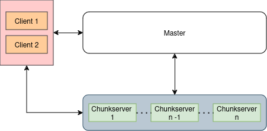

# Distributed File System in Rust
# Project Members
| Name                     | Student Number | Email Address                 |
|--------------------------|----------------|-------------------------------|
| Swapnil Patel            | 99728870       | Swap.patel@mail.utoronto.ca   |
| Hanxiao Chang            | [Insert Here]  | [Insert Here]                 |
| Mohammad Hooman Keshvari | 1011293869  | Hooman.keshvari@mail.utoronto.ca                 |

### Contribution 
- Swapnil Patel: Chunk server, cluster management, documentation
- Hanxiao Chang: 
- Mohammad Hooman Keshvari: Master Node

# Table of Contents
- [Proposals](./PROPOSAL.md)
- [Introduction](#introduction)
- [Architecture](#architecture)
- [How-to use](#how-to-use)
- [Rest API](#rest-api)
- [References](#references)

# Introduction
A **Distributed File System (DFS)** is a system that allows multiple computers to share a common file system, making data accessible and manageable across a network of interconnected machines. It provides a way to store, access, and manage files across various servers or nodes in a distributed manner. The main features of a DFS include:

1\. **Centralized Management**: Despite data being distributed, the DFS offers a unified view of files, allowing users and applications to interact with them as if they were on a local machine.

2\. **Scalability**: It can scale easily by adding more servers or nodes, improving performance and fault tolerance.

3\. **Redundancy and Fault Tolerance**: Files can be replicated across multiple servers to enhance reliability and availability. In case of a server failure, other copies can be accessed.

4\. **Efficiency**: It optimizes data storage, access speed, and resource utilization by distributing files across multiple nodes.

DFS is commonly used in cloud storage, big data processing, and content delivery networks, where access to large volumes of data from multiple locations is essential.

## Project Motivation and Features

The project focuses on designing a **distributed file storage system** to deliver **reliable, efficient, and secure data services**, essential for modern data-driven applications. Inspired by the large-scale data management needs of internet corporations and the rapid growth of big data and AI technologies, the system addresses the limitations of traditional databases while aligning with contemporary trends.

### Key Features:

  - **Reliability:** The system ensures high availability through data replication across multiple nodes, enabling quick fault recovery and efficient load balancing, critical for mission-critical applications.
  - **Flexibility:** Leveraging a master-slave architecture, the system supports horizontal scalability and diverse data formats (structured, semi-structured, and unstructured), making it adaptable to a wide range of applications.
  - **Efficiency:** Optimized data I/O operations minimize latencies and balance network workloads, meeting the needs of resource-constrained applications.
  - **Security:** Distributed architecture reduces risks of breaches while advanced encryption and access control mechanisms further safeguard data integrity and reliability.

### Alignment with Modern Trends:

  - **Big Data and Machine Learning:** The system supports large-scale data analysis and incorporates machine learning for fault tolerance, data recovery, and anomaly detection, enhancing system resilience and security.
  - **Importance of Rust:** Unlike traditional implementations in Java or Golang (e.g., HDFS, GFS), Rust provides superior performance, memory safety, and thread safety. Its ownership model, async runtime support, and efficient concurrency management make it particularly suited for distributed systems.

By addressing the challenges of data consistency and development complexity, the proposed system aims to fill a critical gap in Rust’s ecosystem and contribute to advancing distributed storage technologies.

# Architecture


Our DFS is inspired by the Google File System (GFS) architecture, which is a distributed file system designed to store and manage large volumes of data across multiple servers. The GFS architecture consists of three main components:

1\. **Master Server**: The master server is responsible for managing the metadata of the file system, such as file locations, access permissions, and replication policies. It keeps track of the file system's state and coordinates operations across multiple servers.

2\. **Chunk Servers**: The chunk servers store the actual data in the form of fixed-size chunks. Each chunk is replicated across multiple chunk servers to ensure data availability and reliability. The chunk servers are responsible for storing, replicating, and serving data to clients. *(in progress)*

3\. **Client**: The client interacts with the master server to perform file operations such as reading, writing, and deleting files. The client communicates with the chunk servers to read and write data chunks.

The code structure for above binaries is shown below:
```bash
├── launch_dfs.sh
├── Metadata_Example
├── PROPOSAL.md
├── README.md
└── src
    ├── chunk
    │   ├── chunk_manager.rs
    │   ├── chunk.rs
    │   └── heartbeat_manager.rs
    ├── client
    │   ├── chunk_client.rs
    │   ├── main.rs
    │   └── master_client.rs
    ├── lib.rs
    ├── master
    │   ├── chunk_manager.rs
    │   ├── heartbeat_manager.rs
    │   ├── log_manager.rs
    │   ├── main.rs
    │   ├── namespace_manager.rs
    │   └── safe_map.rs
    └── shared
        ├── log_manager.rs
        ├── master_chunk_utils.rs
        ├── master_client_utils.rs
        └── mod.rs
```
Building the project will generate three binaries:
1. **master**: The master server that manages the metadata of the file system.
2. **chunk_server**: The chunk server that stores and serves data chunks.
3. **client**: The client application that interacts with the master server and chunk servers to perform file operations.

Currently the Client allows user to interact with the DFS using a command-line interface. However, client can be wrapped in a GUI to provide a more user-friendly experience as future work.

## Core Features

The core features of the DFS include:

1\. **File Operations**: The DFS supports basic file operations such as creating, reading, writing, and deleting files. Clients can interact with the file system using a REST API.

2\. **Chunk Management**: The DFS stores data in fixed-size chunks and replicates them across multiple chunk servers to ensure data availability and reliability.

3\. **Fault Tolerance**: The DFS is designed to handle server failures gracefully by replicating data across multiple servers and maintaining multiple copies of each chunk. *(in progress)*

4\. **Scalability**: The DFS can scale horizontally by adding more chunk servers to store additional data and improve performance.

---
# User Guide
## Build the project using "release" configuration
```bash 
cargo build --release 
```
## Launch the cluster from the root directory
DFS can be launched on a local machine for testing and development purposes. The `launch_dfs.sh` script can be used to start the master and chunk servers on the local machine. The script takes the number of chunk servers as an argument and starts the master server and the specified number of chunk servers.

```bash
launch_dfs.sh <number_of_nodes>
```
## Client Operations
Once the cluster is up and running, you can interact with the DFS using the client application. 

The client uses a command-line interface. Below is the general syntax:

```
./client --username <USERNAME> --password <PASSWORD> --target <TARGET> --action <ACTION> [--local-path <LOCAL_PATH>] [--remote-path <REMOTE_PATH>]
```

### **Command-line Parameters**

| Parameter       | Description                                                                                   |
|-----------------|-----------------------------------------------------------------------------------------------|
| `--username`    | Username for authentication.                                                                  |
| `--password`    | Password for authentication.                                                                  |
| `--target`      | Target type for the operation: `file` or `directory` (short forms: `f`, `d`).                 |
| `--action`      | Action to perform: `create`, `read`, `update`, or `delete` (short forms: `c`, `r`, `u`, `d`). |
| `--local-path`  | Path to a local file or directory (used for `create` or `update` operations).                 |
| `--remote-path` | Path to a remote file or directory on the Master Server.                                      |


### 1. **User Authentication**

Every command requires valid user credentials (`--username` and `--password`). The client will authenticate the user with the Master Server before executing any operation.

### 2. **File Operations**

#### a. **Create File**

-   **Description**: Uploads a local file to the Master Server and distributes its chunks to Chunk Servers.
    
-   **Command**:
    
    ```
    ./client --username <USERNAME> --password <PASSWORD> --target file --action create --local-path <LOCAL_PATH> --remote-path <REMOTE_PATH>
    ```
    
-   **Example**:
    
    ```
    ./client --username alice --password secure123 --target file --action create --local-path ./example.txt --remote-path /remote/example.txt
    ```
    

#### b. **Read File**

-   **Description**: Downloads a file from the Chunk Servers and saves it locally.
    
-   **Command**:
    
    ```
    ./client --username <USERNAME> --password <PASSWORD> --target file --action read --local-path <LOCAL_PATH> --remote-path <REMOTE_PATH>
    ```
    
-   **Example**:
    
    ```
    ./client --username alice --password secure123 --target file --action read --local-path ./downloaded.txt --remote-path /remote/example.txt
    ```
    

#### c. **Update File**

-   **Description**: Replaces the contents of a remote file with a local file.
    
-   **Command**:
    
    ```
    ./client --username <USERNAME> --password <PASSWORD> --target file --action update --local-path <LOCAL_PATH> --remote-path <REMOTE_PATH>
    ```
    
-   **Example**:
    
    ```
    ./client --username alice --password secure123 --target file --action update --local-path ./updated.txt --remote-path /remote/example.txt
    ```
    

#### d. **Delete File**  _(Planned)_

-   **Description**: Deletes a remote file.
    
-   **Command**:
    
    ```
    ./client --username <USERNAME> --password <PASSWORD> --target file --action delete --remote-path <REMOTE_PATH>
    ```

### 3. **Directory Operations**

#### a. **Create Directory**

-   **Description**: Creates a new directory on the Master Server.
    
-   **Command**:
    
    ```
    ./client --username <USERNAME> --password <PASSWORD> --target directory --action create --remote-path <REMOTE_PATH>
    ```
    
-   **Example**:
    
    ```
    ./client --username alice --password secure123 --target directory --action create --remote-path /remote/new_directory
    ```
    

#### b. **Read Directory**

-   **Description**: Lists the contents of a remote directory.
    
-   **Command**:
    
    ```
    ./client --username <USERNAME> --password <PASSWORD> --target directory --action read --remote-path <REMOTE_PATH>
    ```
    
-   **Example**:
    
    ```
    ./client --username alice --password secure123 --target directory --action read --remote-path /remote/new_directory
    ```
    

#### c. **Delete Directory**  _(Planned)_

-   **Description**: Deletes a remote directory.
    
-   **Command**:
    
    ```
    ./client --username <USERNAME> --password <PASSWORD> --target directory --action delete --remote-path <REMOTE_PATH>
    ```

## Rest API
The DFS provides a REST API for clients to interact with the system. The API allows clients to perform various operations such as uploading, downloading, deleting, and listing files. The API is implemented using the Rocket framework, which is a lightweight, high-performance web framework for Rust.

### Master
#### Endpoint: `/user/register`
- **Method**: `POST`
- **Description**: Registers a new user by adding their credentials to the system. If the user already exists, an error response is returned.

- **Parameters**:
  - `user`: A JSON object containing the new user's details.
    - `username`: A string representing the username of the new user.
    - `password`: A string representing the password for the new user.

- **Request Example**:
  ```bash
  curl -X POST "http://<base_url>/user/register" -H "Content-Type: application/json" -d '{"username": "exampleuser", "password": "securepassword"}'
    ```

- **Success Response**:
    - **Code**: 200

- **Error Responses**:
    - **400 Bad Request**: If the request is malformed or missing required parameters.
    - **409 Conflict**: If the user already exists in the system.

---
#### Endpoint: `/user/login`
- **Method**: `POST`
- **Description**: Authenticates a user by checking the provided credentials against the stored user data. If the user is not found or the password does not match, an error response is returned.

- **Parameters**:
  - `user`: A JSON object containing the user's credentials.
    - `username`: A string representing the username of the user attempting to log in.
    - `password`: A string representing the password of the user attempting to log in.

- **Request Example**:
  ```bash
  curl -X POST "http://<base_url>/user/login" -H "Content-Type: application/json" -d '{"username": "exampleuser", "password": "securepassword"}'
    ```
- **Success Response**:
    - **Code**: 200
    - **Content**: A JSON object containing the user's authentication token.

- **Error Responses**:
    - **400 Bad Request**: If the request is malformed or missing required parameters.
    - **401 Unauthorized**: If the user is not found or the password does not match.
---
#### Endpoint: `/file/create`
- **Method**: `POST`
- **Description**: Creates a new file at the specified path in the system. If the file already exists or an error occurs during creation, an appropriate error response is returned.

- **Parameters**:
  - `path`: A string representing the path where the new file should be created.

- **Request Example**:
  ```bash
  curl -X POST "http://<base_url>/file/create?path=/path/to/file" -H "Content-Type: application/json"

--- 
#### Endpoint: `/file/read`
- **Method**: `GET`
- **Description**: Reads a specific chunk of a file from the system. The function retrieves the chunk information based on the file path.

- **Parameters**:
  - `path`: A string representing the path to the file.

- **Request Example**:
  ```bash
  curl -X GET "http://<base_url>/file/read?path=/path/to/file"

---
#### Endpoint: `/file/read/all`
- **Method**: `GET`
- **Description**: Reads all chunks of a file from the system. The function retrieves the chunk information based on the file path.

- **Parameters**:
  - `path`: A string representing the path to the file.

- **Request Example**:
  ```bash
  curl -X GET "http://<base_url>/file/read/all?path=/path/to/file"

---
#### Endpoint: `/file/update`
- **Method**: `POST`
- **Description**: Updates an existing file in the system by writing new data chunks. This function is used to modify the file's content or append new data. It returns the updated list of data chunks.

- **Parameters**:
  - `path`: A string representing the path to the file.
  - `size`: An integer indicating the size of the file after the update.

- **Request Example**:
  ```bash
  curl -X POST "http://<base_url>/file/update?path=/path/to/file&size=1024"

---
#### Endpoint: `/file/delete`
- **Method**: `GET`
- **Description**: Deletes a file from the system at the specified path. This action removes the file and all its associated data permanently.

- **Parameters**:
  - `path`: A string representing the path to the file that needs to be deleted.

- **Request Example**:
  ```bash
  curl -X GET "http://<base_url>/file/delete?path=/path/to/file"

---
#### Endpoint: `/dir/create`
- **Method**: `POST`
- **Description**: Creates a new directory at the specified path in the file system. If a directory with the given path already exists, an error response will be returned.

- **Parameters**:
  - `path`: A string representing the path where the new directory should be created.

- **Request Example**:
  ```bash
  curl -X POST "http://<base_url>/dir/create?path=/path/to/directory"

---
#### Endpoint: `/dir/read`
- **Method**: `GET`
- **Description**: Reads and returns the list of directories and files at the specified path in the file system.

- **Parameters**:
  - `path`: A string representing the path of the directory to read.

- **Request Example**:
  ```bash
  curl -X GET "http://<base_url>/dir/read?path=/path/to/directory"

---
#### Endpoint: `/dir/delete`
- **Method**: `POST`
- **Description**: Deletes a directory at the specified path from the file system.

- **Parameters**:
  - `path`: A string representing the path of the directory to delete.

- **Request Example**:
  ```bash
  curl -X POST "http://<base_url>/dir/delete?path=/path/to/directory"

---

### Chunk Server
#### Method: `add_chunk`
- **Description**: Adds a chunk to the chunk manager. This endpoint expects a POST request with binary data as the body of the request and allows specifying a UUID to associate with the chunk.
- **Parameters:**
  - `chunk_id`: The UUID of the chunk to be added.
  - `data`: The binary data of the chunk.
- **Example Request:**
    -   ```bash
        curl -X POST "http://127.0.0.1:8100/add_chunk?id=<UUID>" \
            -H "Content-Type: application/octet-stream" \
            --data-binary @example.bin
        ```
- **Error Responses:**
  - **400 Bad Request**: If the request is malformed or missing required parameters.
  - **413 Payload Too Large**: If the chunk size exceeds the maximum allowed size.
---
#### Method: `update_chunk`
- **Description**: Updates a chunk in the chunk manager. This endpoint expects a POST request with binary data as the body of the request and allows specifying a UUID to associate with the chunk.
- **Parameters:**
  - `chunk_id`: The UUID of the chunk to be updated.
  - `data`: The binary data of the chunk.
- **Example Request:**
    -   ```bash
        curl -X POST "http://127.0.0.1:8100/update_chunk?id=<UUID>" \
            -H "Content-Type: application/octet-stream" \
            --data-binary @example.bin
        ```
- **Error Responses:**
  - **400 Bad Request**: If the request is malformed or missing required parameters.
  - **413 Payload Too Large**: If the chunk size exceeds the maximum allowed size.
---
#### Method: `get_chunk`
- **Description**: Retrieves a chunk from the chunk manager. This endpoint expects a GET request with the UUID of the chunk to be retrieved.
- **Parameters:**
  - `chunk_id`: The UUID of the chunk to be retrieved.
- **Example Request:**
    -   ```bash
        curl -X GET "http://127.0.0.1:8100/get_chunk?id=<UUID>" --output chunk_output.bin
        ```
- **Error Responses:**
    - **400 Bad Request**: If the request is malformed or missing required parameters.
    - **404 Not Found**: If the chunk with the specified UUID does not exist.
---
#### Method: `get_chunk_list`
- **Description**: Retrieves a list of all chunks stored in the chunk manager. This endpoint expects a GET request without any parameters.
- **Example Request:**
    -   ```bash
        curl -X GET "http://127.0.0.1:8100/get_chunk_list"
        ```
- **Success Response:**
    - **Code**: 200
    - **Content**: A JSON array containing the UUIDs of all chunks stored in the chunk manager.
    - **Example Content**:
        ```json
        ["UUID1", "UUID2", "UUID3"]
        ```
- **Error Responses:**
    - **400 Bad Request**: If the request is malformed or contains invalid parameters.
---
#### Method: `delete_chunk`
- **Description**: Deletes a chunk from the chunk manager. This endpoint expects a DELETE request with the UUID of the chunk to be deleted.
- **Parameters:**
  - `chunk_id`: The UUID of the chunk to be deleted.
- **Example Request:**
    -   ```bash
        curl -X GET "http://127.0.0.1:8100/delete_chunk?id=<UUID>"
        ```
- **Error Responses:**
    - **400 Bad Request**: If the request is malformed or missing required parameters.
    - **404 Not Found**: If the chunk with the specified UUID does not exist.


 ## References


1\. Ghemawat, S., Gobioff, H., & Leung, S. T. (2003). The Google File System. In ACM SIGOPS Operating Systems Review (Vol. 37, No. 5, pp. 29-43).

2\. Dean, J., & Ghemawat, S. (2004). MapReduce: Simplified Data Processing on Large Clusters. In Proceedings of the 6th conference on Symposium on Operating Systems Design & Implementation - Volume 6 (pp. 137-150).

3\. Rust official documentation: https://doc.rust-lang.org/

4\. Rocket framework for Rust: https://rocket.rs/
